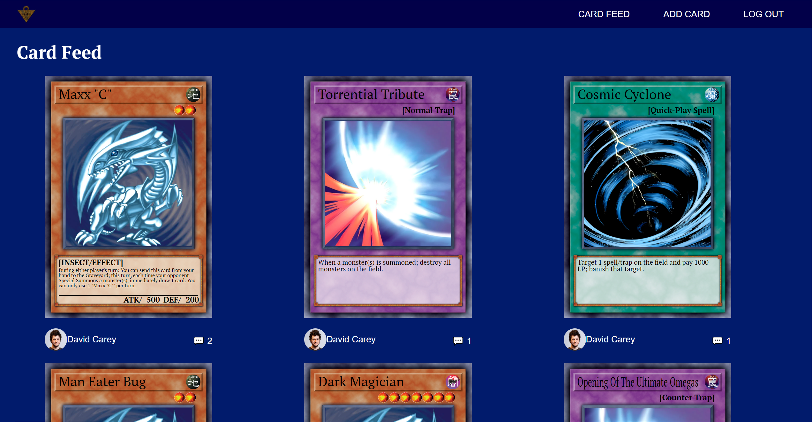
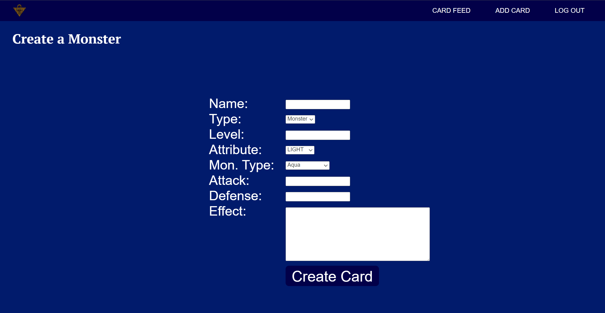
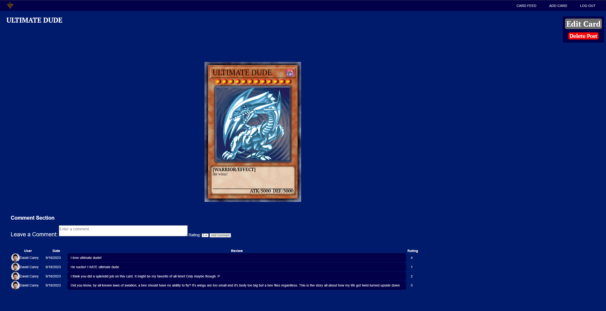

# Yu-Gi-Oh Card Builder #

## Description ##
This web application allows you to create unofficial Yu-Gi-Oh cards, posting them to an ever-expanding feed where other users can view and comment on everyones' creations.

## Screenshots ##
Here's some screenshots of the application!  
Card Feed:
  
Creating a Card:
  
Viewing a Card:

## Technologies Used ##
- HTML
- CSS
- JavaScript
- Express
- Mongoose
- MongoDB
- EJS
- Passport

## Getting Started ##
To try out the application, click this link! [YGO Card Builder](https://ygobuilder.onrender.com)  
Make sure to sign in with your Google account so you can try making/editing Cards and creating comments on Cards you see posted!

## Next Steps ##
In the future, I would like to run through some of the CSS/HTML elements and format them in a cleaner way. I would also like to add a searchbar that allows you to seek out a desired card by it's name or other attributes. I didn't wanna go in over my head and try to allow the user to submit a picture for their cards since I have no idea how complicated that might be and formatting sounds like a nightmare. That being said, allowing users to submit their own images for the card art is the icebox feature I want in my web application the most.

## Early Wireframes ##
If you're curious to see what the early wireframes for this project were like, check them out!
Early Card Feed:

Early Creating a Card:

Early Viewing a Card:
