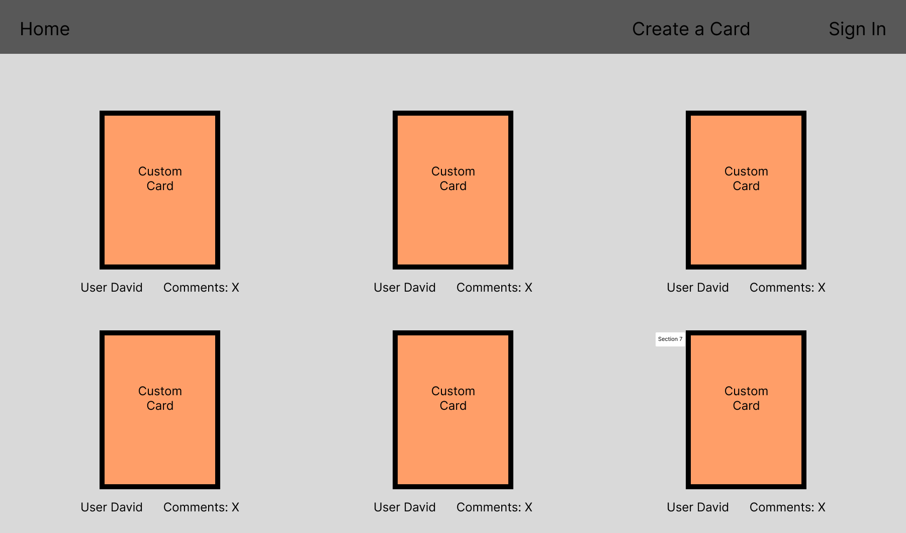
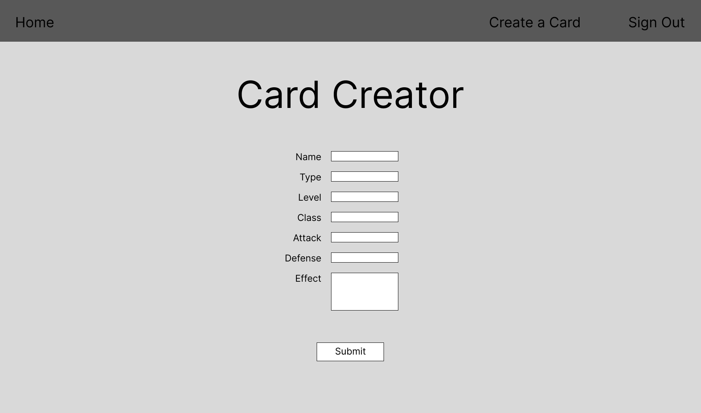
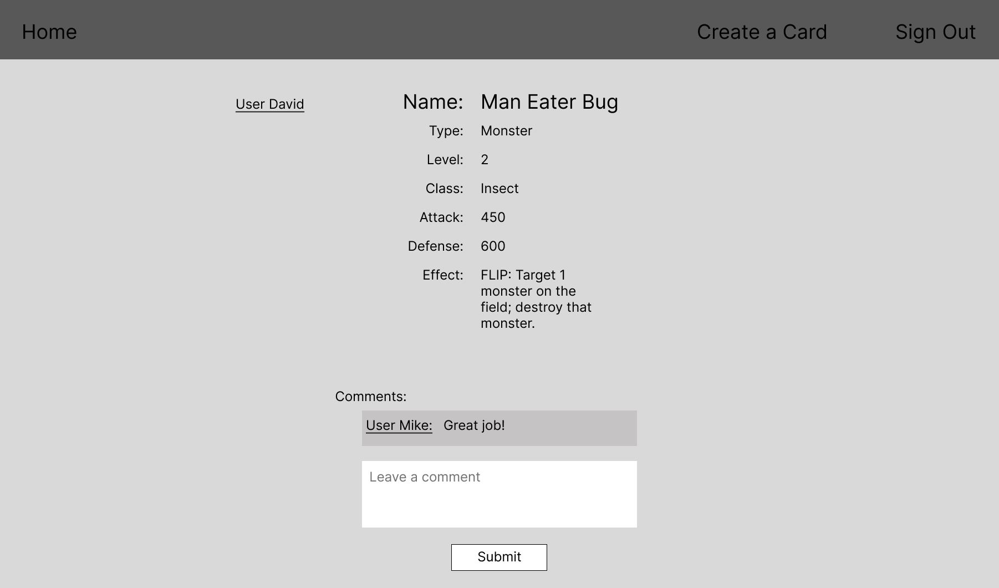

# Yu-Gi-Oh Card Builder #

## Description ##
This web application allows you to create unofficial Yu-Gi-Oh cards, posting them to an ever-expanding feed where other users can view and comment on everyone's creations.

## Screenshots ##
Here's some screenshots of the application!  
Card Feed:
  
Creating a Card:
  
Viewing a Card:

## Technologies Used ##
- HTML
- CSS
- JavaScript
- Express
- Mongoose
- MongoDB
- EJS
- Passport

## Getting Started ##
To try out the application, click this link! [YGO Card Builder](https://davidthecarey.github.io/project1/)  
Make sure to sign in with your Google account so you can try making/editing Cards and creating comments on Cards you see posted!

## Next Steps ##
FILL IN

## Early Wireframes ##
If you're curious to see what the early wireframes for this project were like, check them out!
Early Card Feed:

Early Creating a Card:

Early Viewing a Card:
